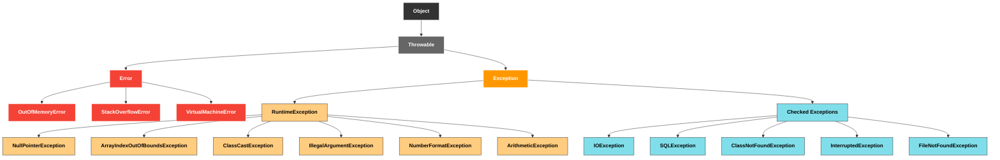

# 2025-08-24 TIL

## Exception Level

### 0. Object 
- 모든 객체의 부모 

### 1. **Throwable (최상위)**
- 모든 예외와 오류의 최상위 클래스.

### 2. **Error (에러 계층)**
- 개발자가 잡지 않는 **심각한 문제들**.
- **예시**
  - `OutOfMemoryError` : 메모리 부족
  - `StackOverflowError` : 무한 재귀로 인한 스택 초과
  - `VirtualMachineError` : JVM 내부 오류

### 3. **Exception (예외 계층)**

#### (1) Checked Exception
- **컴파일 시점에 반드시 처리해야 하는 예외**
- **대표 예시**
  - `IOException`
  - `SQLException`
  - `ClassNotFoundException`
  - `InterruptedException`

#### (2) RuntimeException (Unchecked Exception)
- **실행 중에만 발생하는 예외**
- `try-catch`로 처리하지 않아도 **컴파일 가능**
- **대표 예시**
  - `NullPointerException`
  - `ArrayIndexOutOfBoundsException`
  - `ClassCastException`
  - `IllegalArgumentException`
  - `NumberFormatException`
  - `ArithmeticException`

## Exception Handling
- throw : 예외 발생시키기
- throws : 발생시킨 예외를 메서드 밖으로 던지는 것
- RuntimeException 은 throws 안잡아도 돼. -> 컴파일러가 안잡으니까(Unchecked)
  - 대신 개발자가 놓칠 순 있겠지.

### 기본 규칙(try - catch / throws)
- 예외는 잡아서 처리하거나 밖으로 던져야 한다
- 예외를 잡거나 던질때 지정한 예외 + 자식 예외도 함께 가능 (polymorphism)
> 예외를 처리 안하고, 계속 던지면? -> main() 밖으로 예외를 던지면, 예외 로그를 출력하면서 시스템 종료

